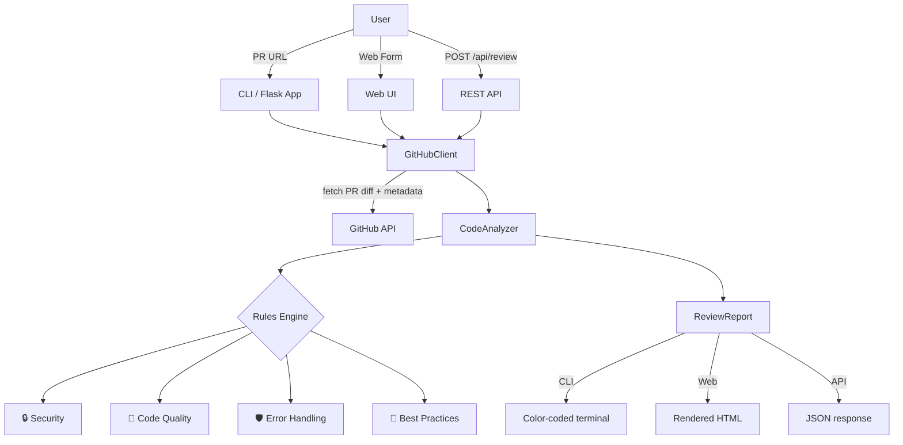
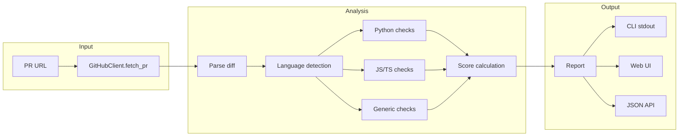
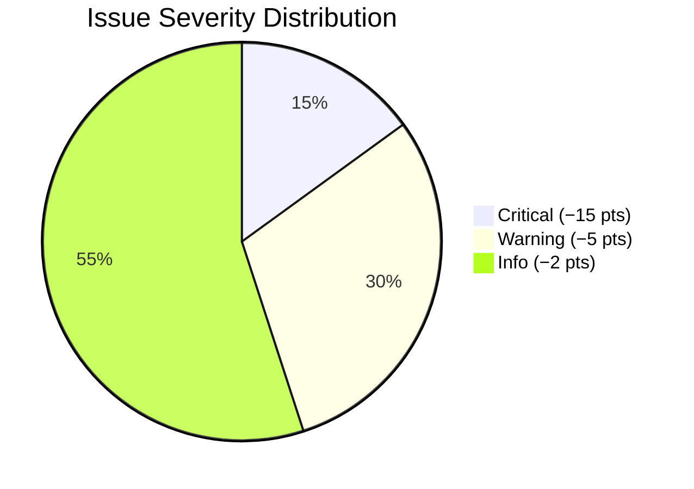

# AI Code Review Assistant

> Analyze GitHub Pull Requests for security, code quality, performance, and best practices — with a scored report.
> Check Here https://al-code-review-assistant-git-hub-pr.vercel.app/

## Features

| Feature | What It Detects | Example Finding |
|---------|----------------|----------------|
| 🔒 **Security** | Hardcoded secrets, SQL injection, `eval()`/`exec()`, XSS via `innerHTML` | `password = "sk_live_xxx"` |
| 🧹 **Code Quality** | TODOs, FIXMEs, `console.log`, `debugger`, wildcard imports, long lines | `import *` pollutes namespace |
| 📐 **Best Practices** | `==` vs `===`, `var` vs `let/const`, `== None` vs `is None`, missing encoding | `x == null` → `x === null` |
| 🛡️ **Error Handling** | Bare `except:`, unguarded `JSON.parse()`, missing try/catch around risky calls | `except:` catches `KeyboardInterrupt` |
| ⚡ **Performance** | Inefficient loops, blocking patterns in hot paths | Nested loop in request handler |

## Architecture





## Quick Start

```bash
pip install -r requirements.txt

# CLI — review any public PR
python app.py https://github.com/psf/requests/pull/6000

# Web UI — starts at http://localhost:5001
python app.py --serve
```

### Private repositories

```bash
python app.py https://github.com/org/private-repo/pull/1 --token ghp_xxxxxxxxxxxx
```

## Usage

### CLI Mode

```bash
# Basic review
python app.py https://github.com/psf/requests/pull/6000

# With GitHub token
python app.py https://github.com/org/private-repo/pull/42 -t ghp_xxxx

# Start web server
python app.py --serve -p 8080

# Help
python app.py --help
```

Example output:

```
============================================================
  AI CODE REVIEW — psf/requests #6000
  Fix timeout handling in sessions
============================================================
  Author: example-user
  Branches: main ← fix/timeout
  Score: 72/100

  Reviewed 3 file(s) (+45/-12 lines). Found 4 issue(s)
  (1 critical, 2 warnings, 1 info).

  STRENGTHS
    ✅ requests/sessions.py: 24 line(s) of Python code reviewed

  CRITICAL
  --------------------------------------------------------
  🔴 src/auth.py:34
     Hardcoded secret detected (Security)
     A credential or secret appears to be hardcoded.
     ➜ Use environment variables or a secrets manager.

  WARNINGS
  --------------------------------------------------------
  ⚠️  src/utils.py:12
     Bare except clause (Error Handling)
     A bare `except:` catches all exceptions.
     ➜ Use `except Exception:` to avoid silencing interrupts.
```

### Web UI Mode

```bash
python app.py --serve
# → http://localhost:5001
```

Paste a PR URL, optionally add a GitHub token, and click **Analyze**. Results show a score badge plus categorized, line-level findings with suggestions.

### REST API

```bash
curl -X POST http://localhost:5001/api/review \
  -H "Content-Type: application/json" \
  -d '{"pr_url": "https://github.com/owner/repo/pull/123"}'
```

Response:

```json
{
  "repo": "owner/repo",
  "pr_number": 123,
  "score": 72,
  "summary": "Reviewed 3 file(s) (+45/-12 lines). Found 4 issue(s) (1 critical, 2 warnings, 1 info).",
  "comments": [
    {
      "file": "src/auth.py",
      "line": 34,
      "severity": "critical",
      "category": "Security",
      "title": "Hardcoded secret detected",
      "description": "A credential or secret appears to be hardcoded.",
      "suggestion": "Use environment variables or a secrets manager."
    }
  ]
}
```

## How Scoring Works



| Severity | Deduction | Examples |
|----------|-----------|----------|
| 🔴 Critical | −15 points | Hardcoded secrets, SQL injection, eval/exec |
| 🟡 Warning | −5 points | Bare except, XSS, `var`, loose equality |
| 🔵 Info | −2 points | TODOs, long lines, console.log, workarounds |

Score = max(0, min(100, 100 − total deductions))

## Supported Languages

| Language | Checks Applied |
|----------|----------------|
| **Python** | All checks + AST-level patterns (bare except, wildcard imports, eval/exec, SQL injection, missing file encoding) |
| **JavaScript / TypeScript** | Loose equality, `var` usage, `innerHTML` XSS, stray `console.log`, unguarded `JSON.parse` |
| **Java / Go / Rust** | Secrets, TODO/FIXME, debug stmts, long lines, fragile markers |
| **Any other** | Common checks (secrets, TODOs, long lines, hack markers) |

## Project Structure

```
├── app.py              # CLI + Flask API entry point
├── github_client.py    # GitHub API client (PR fetch, diff parsing)
├── analyzer.py         # Core analysis engine (language-specific rules)
├── requirements.txt
├── static/
│   └── style.css       # Dark-themed GitHub-style UI
└── templates/
    ├── base.html       # Layout shell
    ├── index.html      # PR URL input form
    ├── report.html     # Scored review results
    └── error.html      # Error display
```

## License

MIT License — see [LICENSE](LICENSE).
